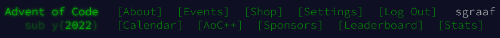

# 🎄 Advent of Code 2022 🌟

This repo contains my solutions for [Advent of Code 2022](https://adventofcode.com/2022/) in Python 🐍 using only the standard library. My solutions might not have the lowest possible computational complexity, but they should all feature good, clean (and largely functional) Pythonic code.

The solution to each day's puzzle (along with any input) is stored in its own directory:

-   [Day 1: Calorie Counting](./day01)
-   [Day 2: Rock Paper Scissors](./day02)
-   [Day 3: Rucksack Reorganization](./day03)
-   [Day 4: Camp Cleanup](./day04)
-   [Day 5: Supply Stacks](./day05)
-   [Day 6: Tuning Trouble](./day06)
-   [Day 7: No Space Left On Device](./day07)
-   [Day 8: Treetop Tree House](./day08)
-   [Day 9: Rope Bridge](./day09)
-   [Day 10: Cathode-Ray Tube](./day10)
-   [Day 11: Monkey in the Middle](./day11)
-   [Day 12: Hill Climbing Algorithm](./day12)
-   [Day 13: Distress Signal](./day13)
-   [Day 14: Regolith Reservoir](./day14)
-   [Day 15: Beacon Exclusion Zone](./day15)
